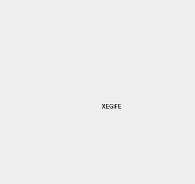

<h1 align="center">Лабораторна робота №3</h1>
<h2 align="center">Тема: Багатопоточне та паралельне програмування на Java</h2>
<h2 align="center">Виконав студент групи 6.1221</h2>
<h2 align="right">Федотов Євгеній Євгенійович</h2>
<h2 align="right">Варіант 2 (оскільки номер за журналом 13-тий, а доступних варіантів 11)</h2>
<h3 align="center">Завдання </h3>

Cоздать фрейм (Swing – приложение) с использованием потоков: строка движется по диагонали. При достижении границ фрейма все символы строки случайным образом меняют регистр.

<h3>Результат виконання роботи:</h3>

